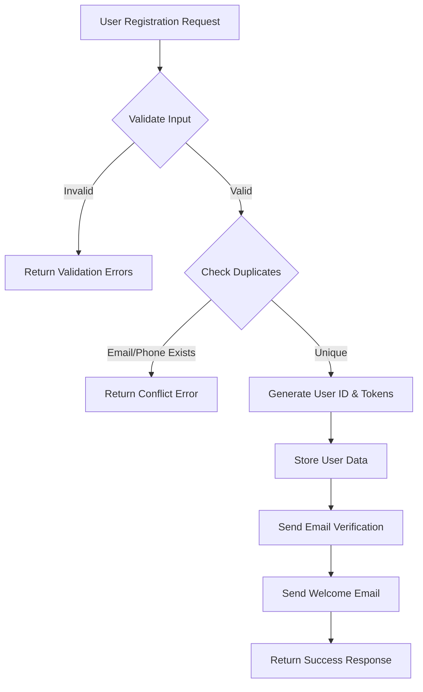
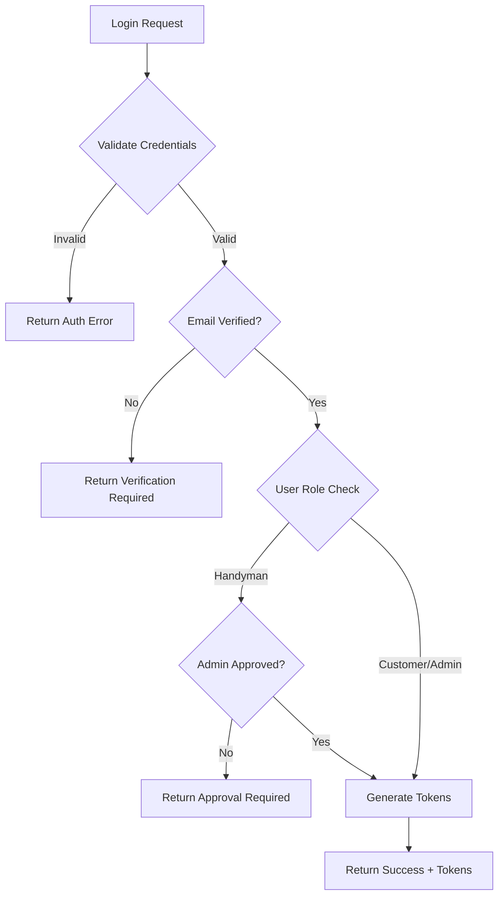

# 🔐 Handyman Management API - Authentication Flow

## 📋 Current Authentication Flow

### **1. User Registration Flow**



**Current Registration Process:**
1. ✅ **Input Validation** - Email, password, role, profile validation
2. ✅ **Duplicate Check** - Email and phone number uniqueness
3. ✅ **User Creation** - Generate user ID and verification token
4. ✅ **Email Verification** - Send verification email via Inngest/Resend
5. ✅ **Welcome Email** - Send welcome email
6. ✅ **Response** - Return user ID and verification status

### **2. User Login Flow**



**Current Login Process:**
1. ✅ **Credential Validation** - Email and password check
2. ✅ **User Lookup** - Find user in store
3. ✅ **Password Verification** - Compare passwords
4. ✅ **Email Verification Check** - Must be verified to login
5. ❌ **Missing: Admin Approval** - Handymen need admin approval
6. ✅ **Token Generation** - Access and refresh tokens
7. ✅ **Response** - Return tokens and user data

---

## 🚨 **Missing: Admin Approval System**

Currently, **handymen can login immediately** after email verification. We need to add:

### **Required Changes:**

1. **Registration Status Field** - Add `approvalStatus` to user data
2. **Admin Approval Endpoint** - Allow admins to approve/reject handymen
3. **Login Approval Check** - Block handyman login until approved
4. **Notification System** - Notify admins of new handyman registrations

---

## 🔧 **Implementation Plan**

### **Step 1: Update User Data Structure**
```javascript
const userData = {
    userId: userId,
    email: email.toLowerCase(),
    password: password,
    role: role,
    profile: profile,
    verificationToken: verificationToken,
    isEmailVerified: false,
    approvalStatus: role === 'handyman' ? 'pending' : 'approved', // NEW
    approvedBy: null, // NEW
    approvedAt: null, // NEW
    createdAt: new Date().toISOString(),
    updatedAt: new Date().toISOString()
};
```

### **Step 2: Update Login Flow**
```javascript
// Check approval status for handymen
if (userData.role === 'handyman' && userData.approvalStatus !== 'approved') {
    return res.status(403).json({
        success: false,
        message: 'Account pending approval',
        errors: [{ field: 'approval', message: 'Your handyman account is pending admin approval' }]
    });
}
```

### **Step 3: Add Admin Endpoints**
- `GET /api/v1/admin/pending-handymen` - List pending handymen
- `POST /api/v1/admin/approve-handyman/:userId` - Approve handyman
- `POST /api/v1/admin/reject-handyman/:userId` - Reject handyman

### **Step 4: Add Notification System**
- Notify admins when new handyman registers
- Notify handyman when approved/rejected

---

## 🎯 **Updated Authentication Flow**

### **For Customers & Admins:**
1. Register → Email Verification → Login ✅

### **For Handymen:**
1. Register → Email Verification → **Admin Approval** → Login ✅

---

## 📊 **User States**

| Role | Email Verified | Admin Approved | Can Login |
|------|---------------|----------------|-----------|
| **Customer** | ✅ | N/A | ✅ |
| **Admin** | ✅ | N/A | ✅ |
| **Handyman** | ✅ | ❌ | ❌ |
| **Handyman** | ✅ | ✅ | ✅ |

---

## 🔄 **Next Steps**

1. **Implement approval status** in user data
2. **Update login flow** to check approval
3. **Add admin endpoints** for approval management
4. **Add notification system** for approvals
5. **Update Postman collection** with new endpoints

---

*This document outlines the current authentication flow and the required changes to implement admin approval for handymen.*
